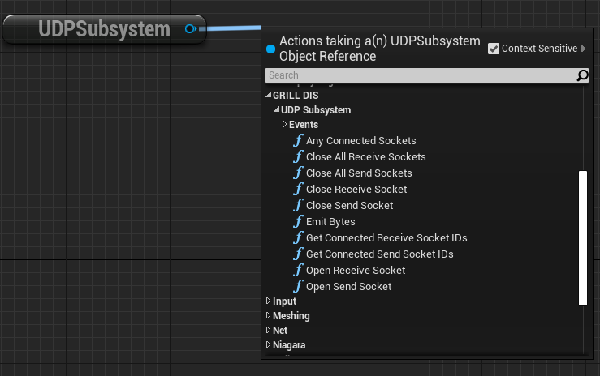

# Getting Started

- This plugin was made for Unreal Engine 4.27
- Clone this repository
- Put the unpacked plugin folder in the 'Plugins' folder for the desired project.
    - The plugins folder should be located in the root directory of the project. If not, create one.
- Launch the project and allow Unreal to rebuild needed modules.
- The GRILL DIS for Unreal plugin should be enabled upon the project opening.

# Required Actors
- Certain actors are required to be in a given level in order for the plugin to work as desired. These are listed below:
	- _**NOTE:**_ Only one of each unique actor type listed below should be in a single level.

- The GeoReferencingSystem actor is required in a level and can be found from the GeoReference Plugin by Epic Games. This plugin should be included when the GRILL DIS for Unreal plugin is installed and it should be enabled by default.
    - This actor stores the Origin Location in real world coordinates in either LLA or in Projected CRS. This is used for conversions between real world coordinated and Unreal Engine coordinates.
        - The website http://epsg.io/ can be used for getting Projected CRS locations.
        - More information on the actor itself can be retrieved at [Unreal Engine's Georeferencing Documentation](https://docs.unrealengine.com/4.27/en-US/BuildingWorlds/Georeferencing/)

- The DIS Game Manager actor is also required in the level and is built into the GRILL DIS for Unreal plugin.
	- This actor stores the DIS Enumeration to class mappings and other various DIS information.
	- **DIS Enumeration Mappings**: Contains desired actor to DIS Enumeration mappings.
        - _**NOTE:**_ The actors tied to DIS Enumerations have to implement the DIS Interface supplied by the GRILL DIS for Unreal plugin and also should have a DIS Component attached to them. Implement the DIS Interface functions to return the associated DIS component of the actor. Refer to the _**DIS Interface**_ section below.
    - **Exercise ID**: The exercise ID of the DIS sim this project will be associated with.
    - **Site ID**: The site ID of this DIS sim.
    - **Application ID**: The application ID of this DIS sim.
		
    - **Auto Connect Send Addresses**: Whether or not the UDP sockets for sending DIS packets should be auto connected.
    - **Auto Connect Send Sockets**: The send sockets to automatically setup if 'Auto Connect Send Addresses' is enabled.
    - **Auto Connect Receive Addresses**: Whether or not the UDP socket for receiving DIS packets should be auto connected.
    - **Auto Connect Receive Sockets**: The receive sockets to automatically setup if 'Auto Connect Receive Addresses' is enabled.
        - _**NOTE:**_ An IP address of 0.0.0.0 will listen to all incoming DIS packets.

# Project Settings

- Access the GRILL DIS for Unreal project settings by clicking on the 'GRILL DIS' button in the Level Editor toolbar or go to Project Settings > GRILL DIS.
- There are currently no settings inside of the DIS project settings.

# UDP Subsystem

- The UDP Subsystem is what is used to control UDP socket connections.
- It can be accessed via blueprints through getting the 'UDPSubsystem'.
- Notable functions:
    - Open Receive Socket
    - Close Receive Socket
    - Open Send Socket
    - Close Send Socket
	- Close All Send Sockets
	- Close All Receive Sockets

- Contains event bindings for:
    - On Receive Socket Opened
    - On Receive Socket Closed
    - On Send Socket Opened
    - On Send Socket Closed
    - On Received Bytes

# PDU Processor Subsystem

- The PDU Processor Subsystem is what is used to convert received bytes to their appropriate DIS PDU struct.
- It can be accessed via blueprints through getting the 'PDUProcessor'
- Notable functions:
    - Process DIS Packet

- Contains event bindings for notifying when a specific PDU type has been processed for all different PDU types currently implemented.

# DIS Game Manager

- The DIS Game Manager is responsible for creating/removing DIS entities as packets are processed by the PDU Processor Subsystem. It also informs the appropriate DIS Entities when DIS packets are received that impact them. This is done through notifying their associated DIS Component.
- The DIS Game Manager can be accessed via a static function called 'GetDISGameManager'.
    - _**NOTE**_: This function performs a 'Get All Actors of Class' behind the scenes. Perform this function as little as possible.
    - This function returns the DIS Game Manager in the current level if one is found. If none or multiple are found, null is returned and an appropriate message is logged.
- The DIS Game Manager contains:
    - Listing of DIS Entities and their associated enumeration. This is loaded from the DIS Class Enum Mappings that needs to be set on the DIS Game Manager once it is placed in the level.
    - Listing of Entity IDs and their active DIS Entities in the world. This is a living list that is added to/removed from as new packets are received.
    - The DIS exercise, site, and application IDs.
- Notable functions:
    - Events for handling every PDU type currently implemented.
    - Add DIS Entity to Map
    - Remove DIS Entity from Map
	- Event for managing dead reckoning on all entities in the level.

# DIS Actor Component

- The DIS Component is responsible for handling all DIS functionality and DIS PDU updates for its associated DIS Entity.
- Handles dead reckoning and ground clamping updates.
    - Automatically handles both of these in C++.
- Contains various DIS related variables.
- Notable functions:
    - Simple Ground Clamping.
        - Can be overriden in blueprints for a custom implementation.
- Contains event bindings for:
    - Receiving each type of DIS Entity PDU currently implemented.
    - Dead reckoning update
- Has variables for:
    - Most Recent Entity State PDU
    - Dead Reckoning Entity State PDU
        - This is an Entity State PDU whose information has been updated with the most recent Dead Reckoning information.
    - Latest Entity State PDU Timestamp
    - Spawned From Network
        - Whether or not this entity was spawned from the network.
    - DIS Timeout
		- How long to wait after an Entity State PDU is received before deleting. Gets refreshed after an Entity State PDU is received.
    - Entity Type
    - Entity ID
	- DIS Culling Mode
		- Culls DIS packets based on settings
			- Options:
				- None
				- Cull Dead Reckoning
					- Cull Dead Reckoning updates
				- Cull All
	- DIS Culling Distance
		- The distance away from the camera that entities will start to have DIS packets culled.
    - Perform Dead Reckoning
        - Whether or not dead reckoning should be performed.
	- Perform Dead Reckoning Smoothing
		- Whether or not to smooth location/rotation changes after receiving a new Entity State update. Prevents entity teleporting.
	- Dead Reckoning Smoothing Period Seconds
		- Time in seconds that smoothing should take place.
    - Perform Ground Clamping
        - Whether or not ground clamping should be perfoemd.
    - Ground Clamping Collision Channel
        - The collision channel that should be used for ground clamping.

# DIS Interface

- The DIS Interface is required to implement for any actor that is desired to be a DIS entity.
- The DIS Interface allows for actors to appear in the Entity section of the DIS Enumeration Mappings UAsset described below.
- After adding the DIS Interface, make sure to implement its 'GetActorDISComponent' function and pass the DIS Component of the actor as the return value.

# DIS Enumeration Mappings

- The DIS Enumeration Mappings UAsset allows for mappings between DIS Enumerations and Unreal Engine actors to be made.
- To create a new DIS Enumeration Mapping UAsset:
    - Right click in the 'Content Browser' of Unreal Engine.
    - Hover over 'Blueprints' of the menu that appears.
    - Select the 'DIS Enumeration Mappings' option.
- Once created, mappings can be created by opening up the UAsset.
- The settings it contains are:
    - DIS Class Enumeration Mappings
        - Mapping of all available Actor to DIS Enumeration mappings.
    - Friendly Name
        - Friendly name of this mapping for easy user lookup
    - DIS Entity
        - The Unreal Engine actor that this mapping should point to.
        - _**NOTE**_: In order for actors to appear in this section, they need to implement the DIS Interface. See the _**DIS Interface**_ section above.
    - Associated DIS Enumerations
        - All desired DIS Enumerations that should point to this actor.
        - _**NOTE**_: If duplicate enumerations are found across multiple entities, an appropriate message is logged and the most recent encountered actor to enumeration mapping is used.
        - _**NOTE**_: If a DIS Enumeration is received on the network and no mapping exists for it, an appropriate message is logged and the packet is ignored.
        - For a breakdown of the individual elements of a DIS Enumeration, refer to the [Naval Postgraduate School's Documentation](http://faculty.nps.edu/brutzman/vrtp/mil/navy/nps/disenumerations/jdbehtmlfiles/pdu/28.htm#:~:text=Description%3A%20The%20type%20of%20entity,necessary%20for%20describing%20the%20entity.).

# DIS Blueprint Function Library

- Contains functions for converting between geospatial coordinates and Unreal Engine coordinates.
- Utilizes the GeoReferencing plugin made by Epic Games for conversions to and from Unreal Engine coordinates.

# PDU Conversion Blueprint Function Library

- Contains functions for converting PDU types to bytes.
	- This allows for sending of the PDUs for example.

